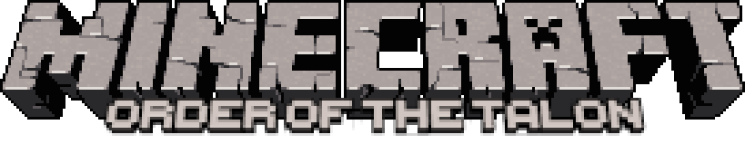

    

Minecraft: Order of the Talon is an open-source full conversion mod for Minecraft Beta 1.7.3. It is currently a work in progress, though as it develops, you'll get to explore many new biomes, experiment with new mechanics, and face new challanges.

## Features
- Extended World Height
- Creative Mode
- New Generation
- Large and deep Caves
- ~~Eventually~~ reworked progression
- Multiplayer support

## Disclaimer

**NOT AN OFFICIAL VERSION OF MINECRAFT. NOT APPROVED BY OR ASSOCIATED WITH MOJANG OR MICROSOFT**